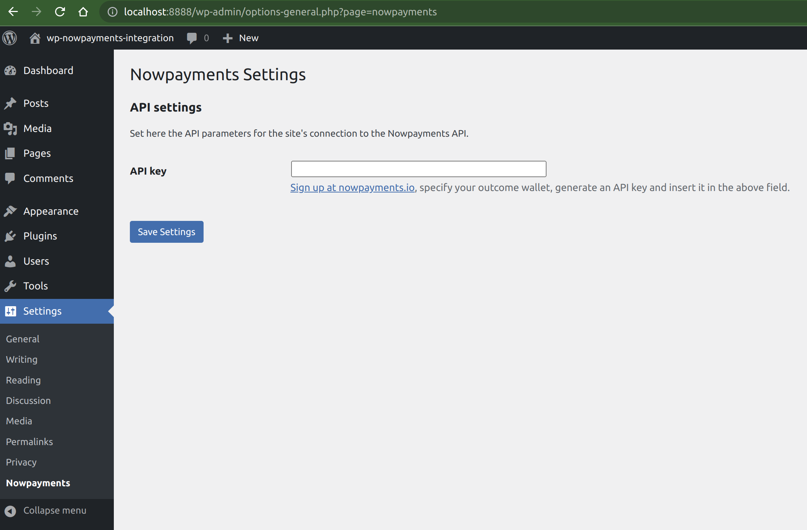

# WordPress nowpayments.io integration

Cryptocurrency Payment integration using the NOWPayments API

**This is still work-in-progress. Don't deploy it into production, please!**

## Quickstart

1. <a href="https://nowpayments.io/?link_id=3530618365">Sign up at nowpayments.io</a>
2. Specify your outcome wallet
3. Generate an API key
4. Insert it in the [settings field](asset/screenshot-1.png)

## Screenshots

## Code

PHP classes for WordPress integration and nowpayments.io communication.

